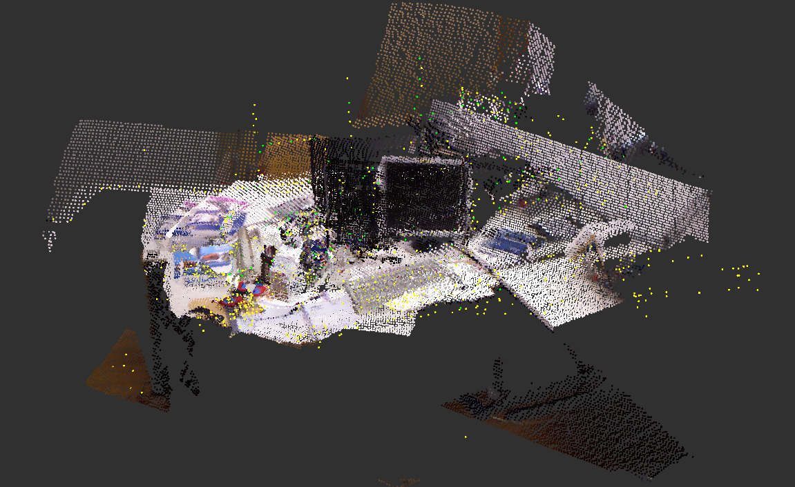
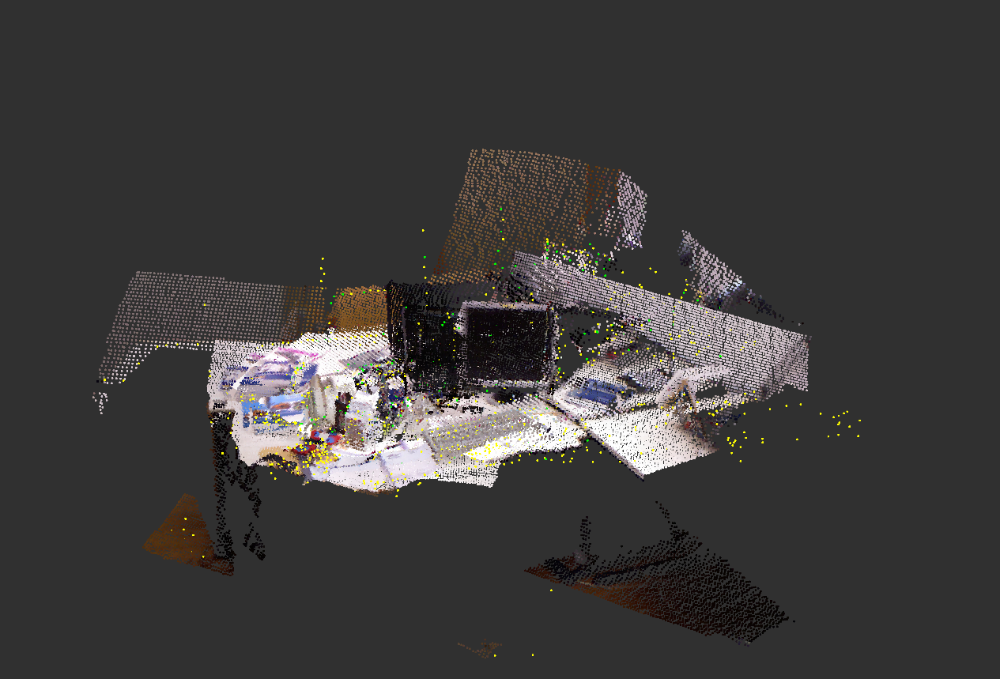

# RTAB-Map RGB-D SLAM

基于 ROS2 Humble + RTAB-Map 实现的 RGB-D 视觉 SLAM 系统，在 TUM RGB-D 数据集上完成 3D 建图与位姿估计。

## 效果展示

## 系统架构

TUM RGB-D Bag -> frame_fixer.py -> RTAB-Map (rgbd_odometry + rtabmap) -> RViz

## 数据集

TUM RGB-D freiburg1_desk
- 传感器：Microsoft Kinect（RGB 640x480 + Depth 640x480）
- 场景：室内办公桌，手持相机扫描，约 23 秒

## 关键技术

- RGB-D 视觉里程计：SURF/BRIEF 特征匹配估计逐帧位姿
- 回环检测：词袋模型识别已访问场景，触发位姿图优化
- 3D 点云建图：深度图反投影至世界坐标系，累积彩色点云
- frame_id 兼容层：ROS1 bag 前导 / 问题通过中间节点动态修复

## 环境要求

- Ubuntu 22.04 + ROS2 Humble
- ros-humble-rtabmap-ros

## 运行方法

终端1 - frame_fixer:
  source /opt/ros/humble/setup.bash
  python3 frame_fixer.py

终端2 - 播放数据集:
  source /opt/ros/humble/setup.bash
  ros2 bag play tum_desk --clock

终端3 - RTAB-Map + RViz:
  source /opt/ros/humble/setup.bash
  ros2 launch rtabmap_launch rtabmap.launch.py rgb_topic:=/fixed/rgb/image_color depth_topic:=/fixed/depth/image camera_info_topic:=/fixed/rgb/camera_info frame_id:=openni_rgb_optical_frame approx_sync:=true use_sim_time:=true rviz:=true

## 技术栈

- ROS2 Humble - 节点通信框架
- RTAB-Map 0.22 - RGB-D SLAM
- TUM RGB-D Dataset - 标准 SLAM 评测数据集
- rosbags - ROS1 转 ROS2 bag 格式转换
- Python / rclpy - frame_id 兼容层
